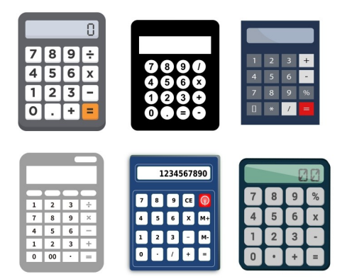

## PRÁTICA SOBRE INTERFACE GRÁFICA DE USUÁRIO E EVENTOS
Implemente em Java uma calculadora que contemple as quatro operações básicas da matemática (soma, subtração, multiplicação e divisão). Essa calculadora deve ser capaz de resolver qualquer equação envolvendo essas operações básicas obedecendo sempre as regras de precedência de operadores da matemática. Portanto, se o usuário digitar a equação 3 + 2 * 5 – 1 o resultado a ser apresentado deve ser 12. A tela da calculadora deve ser semelhante à de calculadoras convencionais existentes no comércio (utilize as imagens a seguir como referência).

Nessa calculadora, o usuário informa os valores e as operações apenas clicando nas teclas (JButton) existentes na mesma. Na medida em que o usuário vai clicando nas teclas, o número que está sendo formado deve ser imediatamente apresentado no visor (JtextField) da calculadora. Ao pressionar a tecla correspondente ao sinal de igual o resultado da equação deve ser apresentado no visor. A seguir são apresentados alguns requisitos funcionais e não funcionais que devem ser atendidos na implementação da calculadora.

### Requisitos funcionais:
- A calculadora não deve permitir que o usuário entre com os dados por meio de digitação direta dos mesmos no seu visor.
- A calculadora deve conter pelo menos as seguintes teclas: 0, 1 , 2, 3, 4, 5, 6, 7, 8, 9, +, -, *, /, ., = e AC. A tecla “.” é usada na formação de números contendo casas decimais. Já a tecla “AC” é responsável por reiniciar a calculadora, permitindo que o usuário entre com uma nova equação.

### Requisitos não funcionais:
- Utilize os gerenciadores de layout apresentados neste curso para implementação dessa GUI. Lembre-se de que a calculadora deve ter uma GUI semelhante àquelas apresentadas na figura anterior.
- A GUI deve ser implementada apenas a partir de código, ou seja, sem a utilização de ferramentas RAD (softwares) que permitem a construção de GUIs a partir de recursos como o drag-and-drop (arrastar e soltar).
- Utilize uma classe para a definição da interface gráfica e outra para implementar a lógica de funcionamento da calculadora, ou seja, para realizar a resolução da equação.
- Realize o tratamento de eventos utilizando classes internas anônimas
